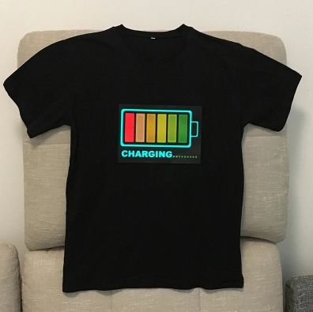

# Theoretical basis of Feeling

Heart rate can represent for different kinds of things to different people.  
1. For elder people especially for the part that has some heart disease, it represents for their health situation in a way.  
   Normally, their heart rate should keep stable. However, when they meet some kinds of emergencies, like receiving sudden stimulation, heart attack. The heart rate will keep high for a while. It's very dangerous for them if no immediate action is taken after this situation keep for a long time.
2. For people work with high pressure, heart rate can also represent for his emotion.  
   If someone is dealing with urgent case like LSI, his heart rate reflects his anxiety. If he meets some important, urgent and also hard LSI, he must be very anxious. So, his heart rate will become high which also means he feel pressurized. It's not good for him to keep that state to work.
3. For the youth, heart rate usually reflects his interesting.  
   If a boy loves a girl, when he stays with the girl, the heart rate will keep higher than normal.
   If someone find something interesting, he will feel excited which will reflect to the heart rate.

However, no matter heart rate and feeling are both invisible things to the others. No one knows how you feel now.
Feeling is a product invents for that. It's some wearable clothes that can present how you feel by detecting the heart rate. It can also give you some feedback under some cases to relax you or even send help for you.

## Feeling can present how you feel
### Elder person or people with high pressure
To the youth, feeling will reflect your feel on the clothes like following shows: 

### The youth
To the youth, feeling will reflect your feel on the clothes like following shows:  
  

Once the heart rate becomes higher, the battery starts charging. It represents for your real emotion. The other people can **see** it

## Material needs to prepare
| Name | Usage | Purchase Link |
| ---- | ----- | ------------- |
|  Lilypad Arduino Board;
|  ECG Module (AD8232); | http://www.instructables.com/id/ECG-Monitoring-System-by-Using-Arduino-or-AD8232/ |
|  ECG Electrodes - 3 pieces (should be replaced by textile electrodes in final prototype);
|  ECG Electrode Connector -3.5 mm;
|  Power supply(Lipo battery);
|  Thin Fabric to paint your design（white）;
|  Conductive thread and conductive fabric;
|  Thermochromatic Pigment;
|  Breadboard for testing;
|  Jumper wires;
|  crocodile wires;
|  Needles;
|  Thirsts;
|  crocodile wires; 
|  crocodile wires; 
|  crocodile wires;
